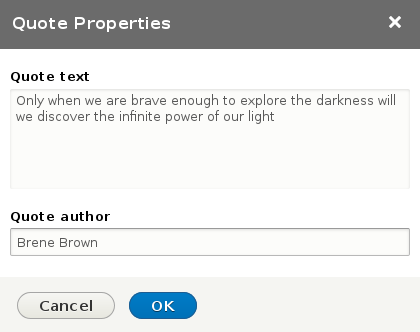

# CKEditor Quote #

A CKEditor plugin for Drupal 8 to create a quote with text and author.

It improves the blockquote plugin by allowing the editor to add an author. It is compatible with previous existing blockquotes without author.

It allows editors to break the quote in different lines (by using &lt;p&gt;).

## Example ##

Using the CKEditor plugin you can enter the quote with the author.



```
<blockquote>
  <p>Only when we are brave enough to explore the darkness will we discover the infinite power of our light</p>
  <div class="author">Brene Brown</div>
</blockquote>
```
